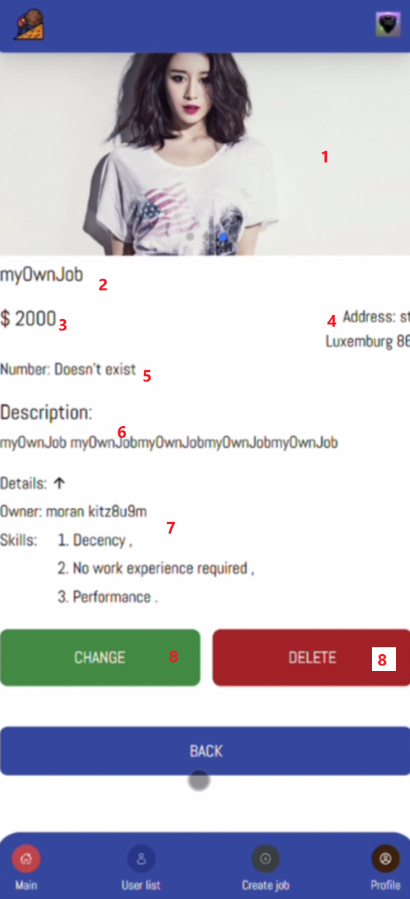

<a id="anchor"></a>

# App for searching short time job 
The web application is about looking for a part-time / one day job:

The user expects to register both in the application itself and via Google.

The main page contains job cards, clicking on which displays all the information about the selected job. 
It is possible to view the:
* address, 
* salary, 
* author of the job, 
* write to him, 
* respond to the job (later the author will see the responses of all applicants).

There is also an opportunity to change your role (job seeker or employer). + the application supports _Russian, English, German, Korean and Chinese._

***

The project is written due to __Vite__ + __ReactJS__ + __Redux Toolkit__ + __React Hook Form__ + __TailwindCSS__

Other libraries: __i18next__ + __react-content-loader__ + __react-icons__ + __react-paginate__ + __redux-persist__ + __swiper__

***

### Page structure:

1. Main
  1.1 NavBar
  1.2 Main Content
2. Login / Registration
3. Card Item
4. Profile
5. Create Job
6. User List
7. History
8. Landing Page
9. Not Found

***

### Instruction:
* Main Page


1. Job Card
2. Filtering (name, salary, order)
3. Find Button
4. Clear fields and recieve all cards
5. Common info: name and info
6. Avatar (link to profile)

* Job Card



1. Photo of Job (you can add several photos or just one)
2. Job Name
3. Salary
4. Address
5. Number (you may add it or not)
6. Job Description
7. Other details: Owner Name and Skills
8. Change Button (you can change Name, salary, address, number and description)
9. Delete button (delete job only if you are owner) + if someone responded this vacancy, it disappears from his history too

* Contact with owner


1. Button for appearing input
2. Respond the current job (emplyer sees profiles who has responded)
3. Field for writting message to employer (it sends throut email)

* Profile


1. Profile Avatar (user can change it anytime)
2. Delete Avatar
3. Main Info: Role, Email, Number
4. Change theme (Light - Dark)
5. Change Language
6. Change profile's data (user can change all types of info)
7. Sign Out
8. Deleted Account
9. List of last clicked Jobs (for employees) and List of last added Jobs (for employers)

* User List


1. Profile's item
2. Filtering employers
3. Buttons "Find" and "Clear"

* Employees' Profile


1. Main info about job seeker
2. Call Button (it's available if person has a telephone number)

* Create Job


1. Fiels for entering job info
2. User can add one or several images to the vacancy
3. Needed Skills (there is a list of items)
3. Create Job Button

* Owned Job


1. Employer can see people who have responded to his/her vacancy and contact with them

Feature 
: In this project I used Lazy Loading Routing from __React__

```
const Home = lazy(() => import(/* webpackChunkName: "Home" */ './pages/Home'));
const About = lazy(() => import(/* webpackChunkName: "About" */ './pages/About'));
const CreateJob = lazy(() => import(/* webpackChunkName: "CreateJob" */ './pages/CreateJob'));
const Profile = lazy(() => import(/* webpackChunkName: "Profile" */ './pages/Profile'));
const Signup = lazy(() => import(/* webpackChunkName: "Signup" */ './pages/Signup'));
const Signin = lazy(() => import(/* webpackChunkName: "Signin" */ './pages/Signin'));
const NotFound = lazy(() => import(/* webpackChunkName: "NotFound" */ './pages/NotFound'));
const CurrentJob = lazy(() => import(/* webpackChunkName: "CurrentJob" */ './pages/CurrentJob'));
const Users = lazy(() => import(/* webpackChunkName: "Users" */ './pages/Users'));
const CurrentUser = lazy(() => import(/* webpackChunkName: "CurrentUser" */ './pages/CurrentUser'));
const Introduction = lazy(() => import(/* webpackChunkName: "Introduction" */ './pages/Introduction'));

function App() {
  const isAuth = useSelector(state => Boolean(state.user.currentUser));
  const [theme, setTheme] = useState(() => {
    return localStorage.getItem("theme") || "light"
  });

  useEffect(() => {
    if (theme === 'dark') {
      document.documentElement.classList.add("dark");
      localStorage.setItem("theme", 'dark')
    } else {
      document.documentElement.classList.remove("dark");
      localStorage.setItem("theme", 'light');
    }
  }, [theme]);

  return (
    <BrowserRouter>
      <Suspense fallback={<Loader />}>
        <div className={`flex flex-col min-h-screen`}>
          <Header isAuth={isAuth} />
          <Routes>
            {isAuth ? <Route path='/' element={<Home />} /> : <Route path='/' element={<Introduction />} />}
            <Route path='/about' element={<About />} />

            <Route element={<PrivateProfile />}>
              <Route path='/create-job' element={<CreateJob />} />
              <Route path='/profile' element={<Profile theme={theme} setTheme={setTheme} />} />
              <Route path='job/:id' element={<CurrentJob />} />
              <Route path='/users' element={<Users />} />
              <Route path='/user/:id' element={<CurrentUser />} />
            </Route>

            <Route path='/sign-up' element={<Signup />} />
            <Route path='/sign-in' element={<Signin />} />

            <Route path='*' element={<NotFound />} />
          </Routes>

          <SideBar isAuth={isAuth} />
          <ToastContainer />
        </div>
      </Suspense>

    </BrowserRouter>
  )
}

export default App
```

[Up](#anchor)